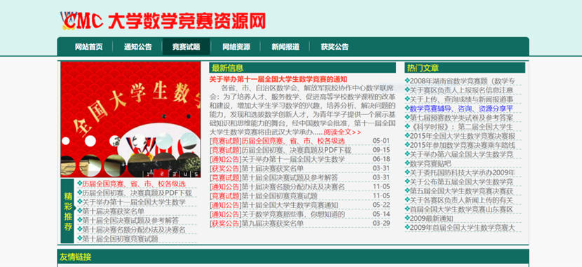

#### 1.竞赛的性质

“中国大学生数学竞赛”的目的是：激励大学生学习数学的兴趣，进一步推动高等学校数学课程的改革和建设，提高大学数学课程的教学水平，发现和选拔数学创新人才。

 #### 2. 竞赛对象

“中国大学生数学竞赛”的参赛对象为大学本科二年级及二年级以上的在校大学生。

 

#### 3.竞赛的内容

“中国大学生数学竞赛”分为数学专业类竞赛题和非数学专业类竞赛题。

（一）中国大学生数学竞赛（数学专业类）竞赛内容为大学本科数学专业基础课的教学内容，即，数学分析占50%，高等代数占35%，解析几何占15%

（二）中国大学生数学竞赛（非数学专业类）竞赛内容为大学本科理工科专业高等数学课程的教学内容

（以上是简单说明，在官网上有更详细的信息，需要了解的，可以自行查看网页http://www.cmathc.cn/article/33.html/）

 

#### 4. 其他

关于竞赛的真题以及题目解析在中国大学生数学竞赛官网（http://www.cmathc.cn/）上都有，此外，关于一些比赛的信息也能在上面得到更及时的信息。

如果查询网站不方便，也可以**关注公众号xwmath**，在公众号内会发布知道的一些数学竞赛相关的通知、赛区赛和决赛试题等信息，如果你有与数学竞赛相关的问题需要咨询，也可以直接在公众号内咨询。

